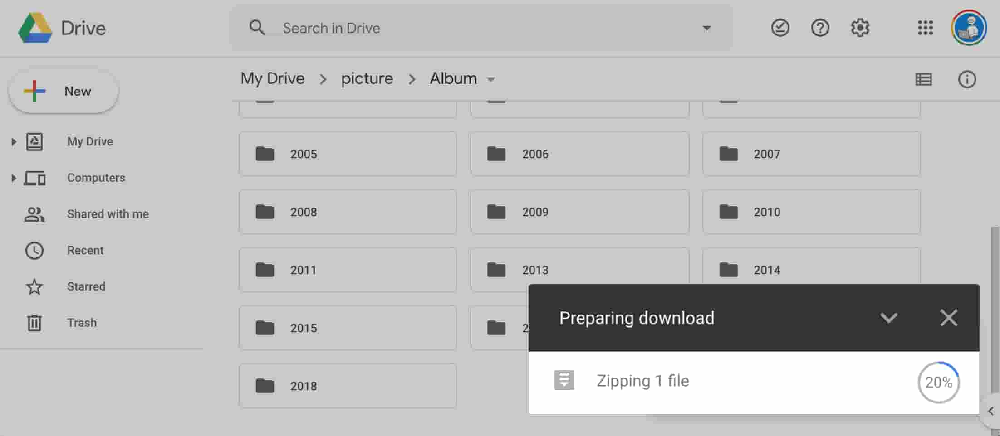

# Google Drive Percentage Extention

An install-and-forget extention to display zipping progress in percentages, when downloading stuff from Google Drive.



## Installation

- [Google Chrome Extention](https://chrome.google.com/webstore/detail/google-drive-percentage/celfcmbafdmmdlncnpncnogmnejfpioj?hl=en&authuser=0)
- [Mozilla Firefox Addon](https://addons.mozilla.org/en-US/firefox/addon/google-drive-percentage/)

## Developing

### step 1: make sure these dev-dependencies are met.

- node 12.18.3
- yarn ^1.16.0

### step 2: clone repository

```sh
$ git clone https://github.com/cure-tomoki/google-drive-percentage-extention
```

### step 3: install dependencies

```sh
# $ cd google-drive-percentage-extention

$ yarn install
```

### step 4: build

```sh
$ yarn build
```

`package.zip` is created in the project root directory if all goes well.

### step 5: run it in the browser

- [steps for Google Chrome](https://developer.chrome.com/extensions/getstarted#manifest)
- [steps for Mozilla Firefox](https://developer.mozilla.org/en-US/docs/Mozilla/Add-ons/WebExtensions/Your_first_WebExtension#Trying_it_out)
